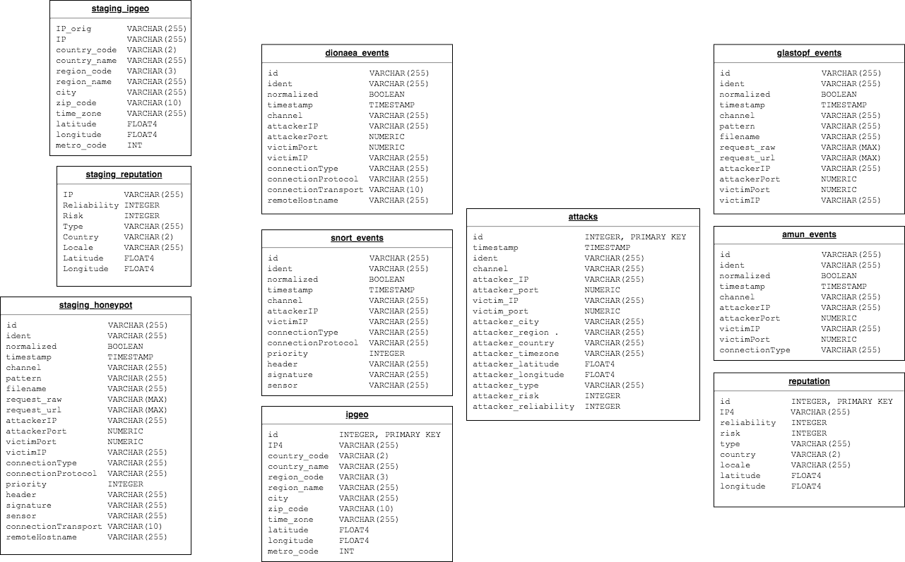

# Data Dictionary

This document gives the data variable names, types, and descriptions for fields in the the dimension and fact tables for the honeypot data warehouse.

The schema diagram is below; the staging tables are in the column on the left. The six dimension tables are: `dionaea_events`, `snort_events`, `glastopf_events`, `amun_events`, `ipgeo`, and `reputation`. The fact table is `attacks`. Since all of the dimension and fact tables are derived directly from the staging tables, we do not list the variables' descriptions for the staging tables here. 

.

# Dimension Tables

There are six dimension tables in the honeypot data warehouse. 

## Dimension: *_events

The four `*_events` tables are all similar; they are simply four different honeypot types. The following variables may appear in all of the four events tables; or they may only appear in one.

* **id** - *VARCHAR(255)* - Unique identifier
* **ident** - *VARCHAR(255)* - Unique identifier
* **normalized** - *BOOLEAN* - Has the request been normalized? 
* **timestamp** - *TIMESTAMP* - Timestamp for event
* **channel** - *VARCHAR(255)* - Collection channel
* **pattern** - *VARCHAR(255)* - Attack pattern if known
* **filename** - *VARCHAR(255)* - Filename for request
* **request_raw** - *VARCHAR(MAX)* - Raw request text
* **request_url** - *VARCHAR(MAX)* - Full request url
* **attackerIP** - *VARCHAR(255)* - Attacker's IP4 address
* **attackerPort** - *NUMERIC* - Port attacker uses
* **victimPort** - *NUMERIC* - Victim's attack port
* **victimIP** - *VARCHAR(255)* - Victim's IP address
* **connectionType** - *VARCHAR(255)* - What type of connection?
* **connectionProtocol** - *VARCHAR(255)* - Attempted connection protocol. 
* **priority** - *INTEGER* - Priority of request
* **header** - *VARCHAR(255)* - Request header
* **signature** - *VARCHAR(255)* - Request signature
* **sensor** - *VARCHAR(255)* - Sensor of receiver.
* **connectionTransport** - *VARCHAR(10)* - Connection transport protocol used
* **remoteHostname** - *VARCHAR(255)* - Remote hostname.  

## Dimension: ipgeo

These are the geolocations for the IP addresses that are part of the *_events tables, as obtained from the freegeoip.app. Note: geolocations for IP addresses can have a fair amount of inaccuracy, for various reasons. See [this blog](https://dyn.com/blog/finding-yourself-the-challenges-of-accurate-ip-geolocation/) for more information. 

* **id** - *INTEGER, PRIMARY KEY* - Auto-incrementing key
* **IP4** - *VARCHAR(255)* - IP address (IPv4)
* **country_code** - *VARCHAR(2)* - 2-letter country code
* **country_name** - *VARCHAR(255)* - Country name
* **region_code** - *VARCHAR(3)* - Region code
* **region_name** - *VARCHAR(255)* - Region name (state/province, usually)
* **city** - *VARCHAR(255)* - City
* **zip_code** - *VARCHAR(10)* - Zip Code
* **time_zone** - *VARCHAR(255)* - Time Zone
* **latitude** - *FLOAT4* - Latitude
* **longitude** - *FLOAT4* - Longitude
* **metro_code** - *INT* - Metro code 

## Dimension: reputation

The reputation table is found via the AlienVault feed, which is updated hourly. We used the following link to download the feed: https://reputation.alienvault.com/reputation.data Note that the geolocations in this data may differ from the geolocations for the same IP address in the `ipgeo` database.

* **id** - *INTEGER, PRIMARY KEY* - Auto-incrementing key
* **IP4** - *VARCHAR(255)* - IP address (IPv4)
* **reliability** - *INTEGER* - Reliability of the AlienVault ratings (larger is more reliable). 
* **risk** - *INTEGER* - Risk of the attacker. Larger is riskier. 
* **type** - *VARCHAR(255)* - Type of attacker (malicious host, usually). 
* **country** - *VARCHAR(255)* - Country name
* **latitude** - *FLOAT4* - Latitude
* **longitude** - *FLOAT4* - Longitude

# Fact Table

We have one fact table in this database: the attacks table. It combines data from the events tables, along with the ipgeo and reputation tables, to list all of the attacks on the various honeypot servers, where those attacks came from, and the reputation/risk if they are part of the AlienVault reputation database. 

## Fact Table: attacks

* **id** - *INTEGER, PRIMARY KEY* - Auto-incrementing key
* **timestamp** - *TIMESTAMP* - Attack timestamp
* **ident** - *VARCHAR(255)* - Unique identifier from events tables. 
* **channel** - *VARCHAR(255)* - event channel
* **attacker_IP** - *VARCHAR(255)* - Attacker IPv4 address.
* **attacker_port** - *NUMERIC* - Attacker's port used
* **victim_IP** - *VARCHAR(255)* - Victim (honeypot) IP address. 
* **victim_port** - *NUMERIC* - Victim (honeypot) Port
* **attacker_city** - *VARCHAR(255)* - Geolocated attacker city (from ipgeo)
* **attacker_region** - *VARCHAR(255)* -  Geolocated attacker region (from ipgeo)
* **attacker_country** - *VARCHAR(255)* - Geolocated attacker country (from ipgeo)
* **attacker_timezone** - *VARCHAR(255)* - Geolocated attacker timezone (from ipgeo)
* **attacker_latitude** - *FLOAT4* - Geolocated attacker latitude (from ipgeo)
* **attacker_longitude** - *FLOAT4* - Geolocated attacker longitude (from ipgeo)
* **attacker_type** - *VARCHAR(255)* - Type of attacker (from reputation)
* **attacker_risk** - *INTEGER* - Attacker risk (from reputation)
* **attacker_reliability** - *INTEGER* - Reliability of attacker information (from reputation) 

